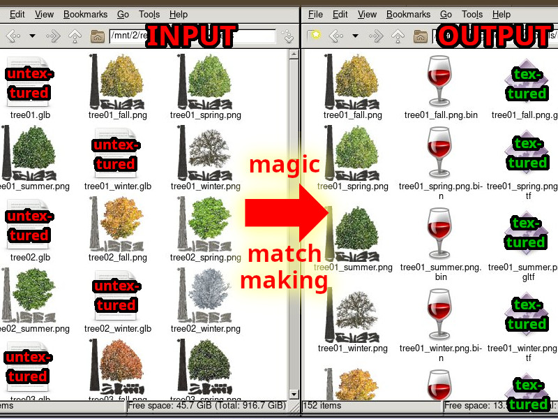

# Batch Apply Model textures and convert to glTF
**advanced brute force edition** for Blender


Very useful for digesting model packs.

* Takes fbx, glb, etc. and outputs gltf
* Works with normal maps, metallic, etc.
* gradually descends from sane to insane when associating model to image files

## Instructions
1. open an empty file in Blender
2. paste BAM.py in "Scripting"
3. edit the input and output dir
4. execute script
5. profit


(Debug output in system console, not Blender console)

## Illustrated use case

[](#) 


[](#)

```
Copyright:    2023 @Ballerburg9005 
License:      GPL-3 or later
https://github.com/ballerburg9005/BAM
```
